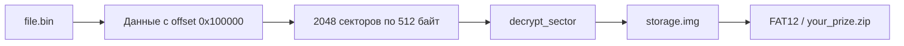

# Получение данных из прошивки

Продолжая серию реверса: в IDA была найдена функция чтения USB Mass Storage по адресу `0x10000354`. Она берёт данные из второй половины внешней Flash, начиная со смещения 0x100000 внутри file.bin .

Функция шифрует XOR и шифрует 1 Мб по 512 байт.



Функция `0x1000053c` использует как encode и decode, так как XOR симметричный.

Псевдокод находится в [`pseudocode/03_read_and_decrypt.c`](https://github.com/trimesh33/r3dc4t/blob/main/decrypt-flash/pseudocode/03_read_and_decrypt.c).file storage.img

Реализация расшифровки — в [`decrypt.py`](https://github.com/trimesh33/r3dc4t/blob/main/decrypt-flash/decrypt.py).

### Использование расшифровки

```bash
python3 decrypt.py ../reverse-ida/file.bin
file drive.img
```

```bash
mkdir -p /tmp/storage
sudo mount -o loop,ro -t vfat drive.img /tmp/storage
ls -la /tmp/storage
```

