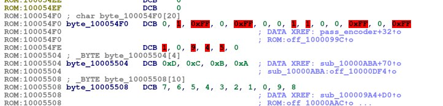
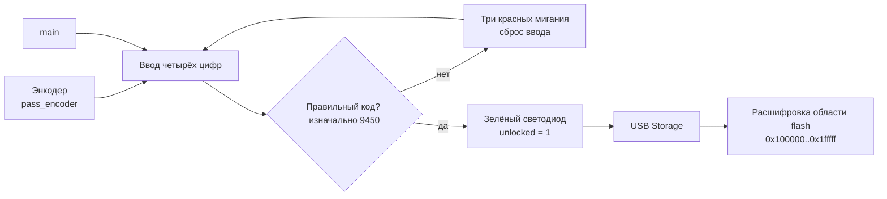

# Реверс кода в IDA

После получения прошивки через [прямое чтение Flash](https://github.com/trimesh33/r3dc4t/blob/main/direct_read/README.md) или с помощью `picotools` был получен файл `file.bin` и он был загружен в IDA как прошивка ARM Cortex-M0+ с базовым адресом `0x10000000`. После загрузки был использован файл с [разметкой регистра для мк](https://github.com/raspberrypi/pico-sdk/blob/master/src/rp2040/hardware_regs/RP2040.svd).

В обработчике `pass_encoder` по адресу `0x10000944` нашли чтение энкодера с GPIO 27/29 и кнопки с GPIO 28. По ссылкам на общие переменные перешли в функцию ввода пароля `0x10000AB0`.

В ней введённые цифры сравниваются с четырьмя байтами по адресу `0x10005500`:

```text
09 04 05 00
```



До этого в массиве лежит то расшифровывается энкодер.


Найденный пароль: **9450**.

# Схема вызовов функций



До правильного кода программа остаётся внутри функции ввода. USB-хранилище инициализируется только после её успешного завершения.


Псевдокод двух основных функций для ввода пароля находится в [`pseudocode`](https://github.com/trimesh33/r3dc4t/blob/main/reverse-ida/pseudocode).

# Подмена кода и изменение поведения платы

Исходя из того, что мы нашли можно понять, что достаточно всего подменить байты пароля, чтобы изменить работу платы и сделать свой пароль: реализовали пароль **0000** (но можно какой угодно).

[Видео работы](https://github.com/trimesh33/r3dc4t/blob/main/img/pass0000-files.mp4)

[Видео работы с показом файлов на ноутбуке](https://github.com/trimesh33/r3dc4t/blob/main/img/pass0000-files.mp4)


\* На видео видно соединение проводов, потому что мы уже отпаяли память и работами в FPGA, поэтому схема немного интересная, но ничем не отличается от изначальной кроме подмены пароля \))


## Обход ввода пароля

В функции main по адресу 0x100008A6 есть вызов функции ввода пароля 0x10000AB0 мы его заменили двумя инструкциями NOP (do nothing) и сразу перешли к расшифровки флешки, светодиоды не горят но флешка видна.


---

После этого мы хотели не изменять прошивку а подменять на лету и пошли реализовывать это с помощью FPGA (ПЛИС).